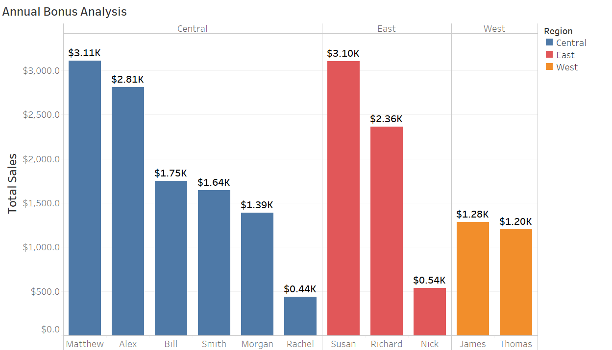

### Problem Statement:
Its EOFY and that means time for annual bonus!
The Store operates in three regions and only the 
top-performing employee in each region qualifies for a bonus.
Find out which three emplloyees are eligible to get bonus for this year.
Employess are measured on total sales($$)
### Graph:

### Conclusion:
From Central region Matthew qualify for bonus,
From East region Susan qualify for bonus and
 From West region James qualify for bonus.

